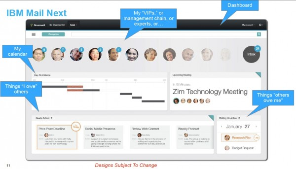
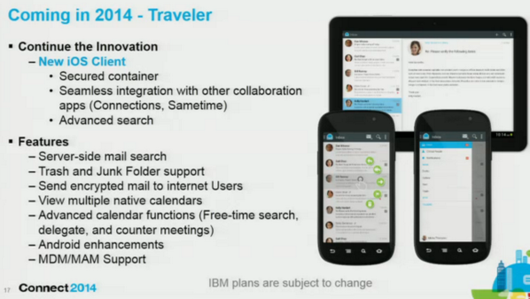

---
authors:
  - serdar

title: "Orlando'dan Kürkçü Dükkanına dönüş..."

slug: orlandodan-kurkcu-dukkanina-donus...

date: 2014-02-05T16:35:00+02:00

---

Üçüncü IBM Connect (nam-ı diğer Lotusphere) maceram iki gün önce sona erdi. Dönüş yolunda bir blogum olduğunu hatırladım ve yazacak bir şeyler planladım. Sonra ateş ve kas ağrısıyla tamamlanan işkence dolu bir uçak seyahati tüm söyleyeceklerimi unutturdu... O yüzden şimdi doğaçlama yazıyorum, dur bakalım ne olacak...

Kendi adıma, üçüncü Orlando macerasına birkez daha IBM Şampiyonu olarak gitmek ve ikinci kez konuşma şansı yakalamış olmak önemli bir motivasyondu. Ne de olsa kapıdan kapıya 20 saatlik yolculuğu ve o kadar maliyeti katlanılır kılan önemli bir sebep olmalı.
<!-- more -->

Konuşmayla başlayalım o zaman. Kanada'dan değerli bir dostum Graham Acres ile yaptığımız sunum **IBM Social Business Toolkit SDK** hakkında idi. Sunuma [buradan](https://speakerdeck.com/sbasegmez/bp308-the-journey-to-becoming-a-social-application-developer) ulaşabilirsiniz. Demo veritabanları hazır olduğunda bu yazının sonuna ekleyeceğim.

Kısa bir özet geçelim. Uzun süredir Social Business diye yatıp "IBM Social Platform" diye kalkıyoruz. IBM Collaboration Solutions etrafında yeralan tüm ürünler (IBM Notes/Domino, Connections, Sametime, SmartCloud for Social Business vs) kendilerine has API'lar ile belli fonksiyonlara erişim sunuyorlar. Örneğin Domino, sunduğu REST API ile veritabanlarına, takvim ve mesajlaşma fonksiyonlarına erişim verirken Connections ya da SmartCloud'a ait REST API'lar üzerinden profillere veya dosyalara erişebiliyoruz. SBT ise tüm bu API'lara erişim için kullanılacak devasa bir SDK (Software Development Kit) kütüphanesi. IBM Social ürün ailesine; Java, JavaScript, XPages, iOS, PHP gibi teknolojilerle zahmetsiz bir şekilde erişebilir, oradaki içeriği kullanabilir, içerikleri ve aksiyonları kendi uygulamalarımıza entegre edebiliriz. Detaylar hakkında daha geniş bir workshop düzenlemek istiyorum, ilgilenen olursa. Çünkü 1-2 yazıda tamamını kapsayamayacağımız bir konu aslında.

Özetle, herhangi bir REST API ile (Twitter, Connections, ne olursa...) iletişime geçmek için epey kod yazmak gerekiyor. SBT burada iki temel fayda sağlıyor. Low-Level API dediğimiz çekirdek kütüphaneler ihtiyaç duyacağımız yapısal kaynakları sunuyor. Örneğin OAuth modülleri veya JSON/XML parser'lar. Nitekim yaptığımız birinci demo'da XPages uygulamasını Basecamp'le konuşturmuş ve Connections ana sayfasına eklediğimiz bir widget'la Basecamp-Connections arasında nasıl dosya transferi yapılabileceğini göstermiştik.

İkinci fayda ise High-Level API dediğimiz üstyapı. Bu kapsamda sağlanan yapılar Connections, SmartCloud gibi spesifik ürünlerin sağladığı servislere doğrudan ulaşmamızı sağlıyor. Karşı tarafın REST API'sinin nasıl çalıştığını bilmemize gerek kalmadan dosyaların listesine erişebiliyor, yeni bir wiki makalesi oluşturabiliyor ya da blog yazısının yorumlarını kendi uygulamamızın içeriğine dahil edebiliyoruz. Üstelik bunu 2-3 satır kod yazarak yapıyoruz.

Son geliştirmeler ile PHP, iOS gibi platformlara da yayılan SBT, uygulama geliştirme alanında IBM'in ilerleyen dönemdeki en önemli projesi olmaya devam edecek. İşin güzeli tüm SDK açık kaynak koduyla birlikte Github üzerinden takip edilebilir, dileyenler bu projeye katkıda bulunabilirler.

Gelelim IBM Connect'te bu yıl neler oldu kısmına...

En çok ses getiren konu IBM Mail Next, IBM Connections Mail, New Mail ve benzeri değişik isimlerle anılmış olan yeni nesil e-mail platformu idi. Standard e-posta, iş yapma ve analitik fonksiyonları birleştirmeyi amaçlayan bu yeni e-mail platformu endüstriden olumlu not almış görünüyor.

Projenin henüz Tasarım ekibinden Geliştirme ekibine geçmediğini düşünürsek her şeyin değişebileceğini aklımızın bir köşesine not düşelim ([Bunu](2010-01-project-vulcan-lotus-notes-ve-gelecegi.md "project-vulcan-lotus-notes-ve-gelecegi.htm") hatırlayan var mı?).

Bu yeni istemci web tabanlı olacak, çevrimdışı kullanımı destekleyecek, öncelikle bulut platformda kullanıma açılacak ve önemli bir detay; IBM Domino üzerinde çalışacak. Alan Lepofsky, fikirlerini çok değerli bulduğum bir analist, şöyle [demiş](http://www.alanlepofsky.net/alepofsky/alanblog.nsf/dx/ibm-mail-next-your-new-personal-interaction-manager):

> ...Mail Next, bugüne dek Notes/Domino ve Connections dünyalarını birleştirecek en etkili plan gibi görünüyor. Doğru yapılırsa, müşteriler hangi platform ürünlerini kullandıklarını düşünmek zorunda kalmayacak ve basitçe son kullanıcı deneyimine odaklanabilecekler. XWork sunucularında çalışan XPages uygulamaları ile Mail Next ve Connections web tarayıcılarından erişilebilir olacak ve işletim sistemine bağımlı Notes istemciye olan ihtiyaçlar azalacak...

 

Yazının tamamını okumakta fayda var. Ama biz bir konunun altını tekrar çizelim. Mail Next, IBM Domino platformunda çalışacak. Bu bilgi önemli, çünkü yıllardır süregelen efsanelere rağmen IBM Domino, henüz ölmenin kıyısına bile yaklaşmadı, uzun bir zaman daha yaşayacak...

Kişisel fikrim çok erken beklentiye girmemek yönünde. Bu projenin şeklen bile oturması 1 yıl alır düşüncesindeyim. Daha çok tartışırız bunu.

Gelelim diğer konulara...

Geçen yıl Lotus markasının tamamen kaldırılması, marka/isim değişikliği tartışmalarından sonra bunu geride bırakmış olmanın rahatlığı vardı sanırım. O kadar şanslı değiliz, çünkü bütün markalar bir daha değişiyor :)

Doğru duydunuz, IBM amiral gemisi olarak belirlediği Connections ürününü bu kez ürünlerin de merkezine alıyor. Kramer Reeves (Ed Brill'in görevini devralan ürün direktörü) dün kaleme aldığı [şu yazıyla](http://www.socialbizug.org/blogs/Kramer/entry/branding_insights) konuyu daha net bir şekilde açıkladı...

* IBM Connections (Şu anki Connections ürünü)
* IBM Connections Docs (IBM Docs idi)
* IBM Connections Chat (Sametime idi)
* IBM Connections Meetings (Sametime idi)
* IBM Connections Mail (Burası biraz karışık...)

 

Kramer Reeves, IBM Connections Mail konusunda şöyle yazmış:

> IBM Notes \& Domino, bu kapsamda tekrar marka değişikliğine uğramayacak. Fakat IBM Mail Next'in pazara sürülmesiyle birlikte bu tip bir marka değişikliği düşünülebilir. IBM şu anda iki paketleme seçeneği düşünüyor:
>
> - Connections içerisineki Mail uygulaması "Mail Next" ürünü doğrultusunda tekrar sunulacak.
> - Standalone: IBM Mail Next muhtemelen stand-alone (bağımsız) mesajlaşma çözümü olarak konumlandırılacak.

 

Biraz bulanık da olsa IBM Notes'un 1-2 yıl sonra tekrar marka değişikliğine gideceğinin işareti olarak okunabilir bu mesajlar. Zaman gösterecek.

Ufak tefek birkaç haber daha vermek gerekirse,

* Softlayer üzerinde "XPages on the Cloud" servisi açılıyor. Bu sayede XPages uygulamalarımızı Cloud üzerinde barındırabileceğiz.
* Dil paketleri için 60-120 gün bekleme yakında tarihe kavuşuyor (SONUNDA!). IBM Notes/Domino ailesinde tüm dillerin aynı anda çıkması gündemde, ne zaman başlanacak bilmiyoruz.
* iOS için E-posta istemcisi yolda. iOS'un kendi mail arabiriminin sebep olduğu kısıtlamalar sebebiyle IBM yeni bir mobil uygulama tasarlıyor.
* Lotus Domino FullText Index yapısının Apache Solr üzerine geçirilmesi için çalışmalar başlatılmış durumda.
* IBM Social Platform üzerinde geliştirme yapmak isteyenleri hedefleyen Domino-Connections-Sametime kurulu hazır sunucu imajları geçtiğimiz yıl SmartCloud üzerinden kiralanmaya başlanmıştı. Bu yıl içerisinde bunların ücretsiz indirilmesi mümkün olacak.
* Yıl sonuna doğru Notes Browser plugin için Safari/MacOS desteği çıkması gündemde.

 

 

Ülkemizi ilgilendiren bir gelişme de Türkiye'nin IBM içerisindeki bölgesel değişikliği. Bundan birkaç yıl önce EMEA (Europe, Middle East, Africa) bölgesinden CEE (Central Eastern Europe) bölgesine taşınmıştık. Bu geçiş süreci biz iş ortakları için biraz problemli olmuştu. Tüm kanal/ürün yönetimi değişmiş, sudan çıkmış balığa dönmüştük. Zaman geçti ve aslında bu değişikliğin bizim için olumlu olduğunu gördük. Çünkü yeni bölgede önemli ve güçlü bir pazar haline gelmiştik. Sahip olduğumuz kaynaklar artmış, yerel IBM kadrosu büyümüş ve bir anda ilgi alaka görür olmuştuk. Bugünlerde resmi duyurusunu beklediğimiz değişiklik ise MEA (Middle East Africa) geçişi. Bu durumda Türkiye organizasyonu Dubai'ye bağlanıyor. Kişisel fikirlerim bu konuda çok olumlu olmamakla birlikte bekleyip görmekten başka şansımız da yok. Umarız bu değişiklik bizler için sancısız geçer.

Bunların dışında Developi açısından da bazı değişiklikler yapmanın zamanı gelmişti. Türkiye pazarında IBM yazılım teknolojilerinin gidişatı düşünülünce Domino ve XPages etrafındaki iş fırsatlarında bir daralma olduğu görülüyor. Bu yüzden diğer ülkelerden çeşitli müşterilere ulaşmak, yeni projelerde çalışmakla ilgili girişimlerim bir süredir devam ediyordu. Bunların meyvelerini almaya başladık. Netleştikçe bunlarla ilgili ayrıntıları vermeye de devam ederim.

Sonuç olarak, IBM İşbirliği ürünleri Connections önderliğinde bir yola girmiş hızlanmaya başlıyor. Bu dönemde büyük şirketler için Connections ve diğer ürünlerin merkezde konumlandırıldığı, küçük şirketler için de benzer fonksiyonlara sahip bulut uygulamalarının merkeze alındığı bir strateji görüyoruz. Her ne kadar bulut temelli pratiklerin Türk pazarı için erken olduğunu düşünsem de zamanın beni haksız çıkarmasını umuyorum. Çünkü pazarın genel baskısı da bu yönde. IBM Softlayer satınalması ile bu alanda çok sağlam bir temel oturtmuş oldu.

Bu noktada Türkiye'de devlet bürokrasisinin teknoloji alanına uyguladığı saçma sapan sansür ve kontrol mekanizmaları nedeniyle endişeliyim. Geçmişte Google ile Youtube üzerinden yaşanan polemikler Google Apps müşterilerine çok zarar vermişti.. Yapılan son yasal düzenlemelerden sonra aklı başında hiçbir bulut bilişim şirketinin Türkiye'de milyon dolarlar riske atması olası değil. Umuyorum en çabuk yoldan aklımızı başımıza toplarız, yoksa önceki neslin bize anlattığı "Adana'da mikroçip fabrikası kurulacakmış da şöyle olmuş böyle olmuş" efsaneler gibi bizler de bulut bilişimle ilgili hikayeler anlatmaya başlarız...

Soruları alalım :)
