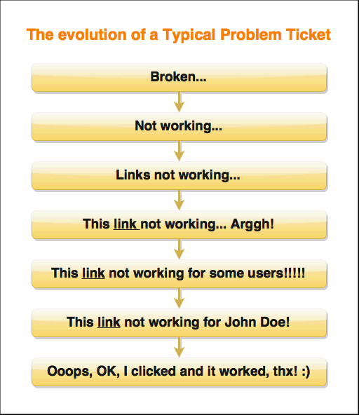

---
authors:
  - serdar

title: "DTFC: Beşerdir şaşar, geliştirici de insandır, unutur..."

slug: dtfc-beserdir-sasar-gelistirici-de-insandir-unutur...

date: 2015-10-03T12:08:33+02:00

---

Uygulama geliştiriciler kodlarına çok güvenirler. Çok fazla 'comment' ya da 'dokümantasyon' meraklısı olmamamız bununla ilgili sanırım. Bu alışkanlığı kıramayanlar, benim gibi, rezil olup dururlar :)

Tamam, son kullanıcılarla uğraşmak ölüm olabilir... Genelde aldığım hata bildirimleri şöyle gelişiyor.
<!-- more -->

Ama tüm kullanıcı problemlerine böyle davranınca, aşırı güven de işin içine girerse, dikkat etmek gerekiyor...

> Kullanıcıdan soru: "XXX" işlemini nasıl yapacağız? *(İçinden saydırma safhası)*
>
> Cevap: Orada dana kadar button var görmüyor musunuz? "XXX yap" yazıyor? *(Müşteriden ekran görüntüsü gelir)*
>
> Kullanıcı: Hani nerede? *(Ooops...)*
>
> Cevap: Iıııh... Hımmm. Şey... Pardon... Sizin yetkiniz yok tabi onu yapmaya... Hımmm. Çok özür... Siz gönderin, ben yapayım... Pardon...

 

Başka bir örnek:

> Kullanıcıdan soru: "ZZZ" oldu, bana mesaj gelmesi gerekiyordu, gelmedi? *(İçinden saydırma safhası)*
>
> Cevap: Öyle şey olmaz! Bu kod N yıldır çalışıyor... Mesaj gelmiştir, silmişsinizdir, saçmalamayın!!! *(Biraz zaman geçer...)*
>
> Kullanıcı: Benden başka 4 kişiye daha gelmesi gerekiyordu, hiç birimize gelmemiş! Onlar da mı sildi kazara??? *(Dur ben bulayım şu mesajı da rezil edeyim...)* *(Ara...)* *(Ara...)* *(Ara...)* *(Ara...)* *(Ooops...)*
>
> Cevap: Iıııh... Hımmm. Şey... Pardon... Hakkaten gitmemiş... Hımmm. Çok özür... Hede hödö olmuş, olmamış, öyle patlamış, şöyle çatlamış... Pardon...

 

Bu durumlarla karşılaşıp rezil olmamak için, DTFC!

Yani, **DEBUG THE FUCKING CODE** ! *(Şu 'lanet olası' kodu debug et!)*
